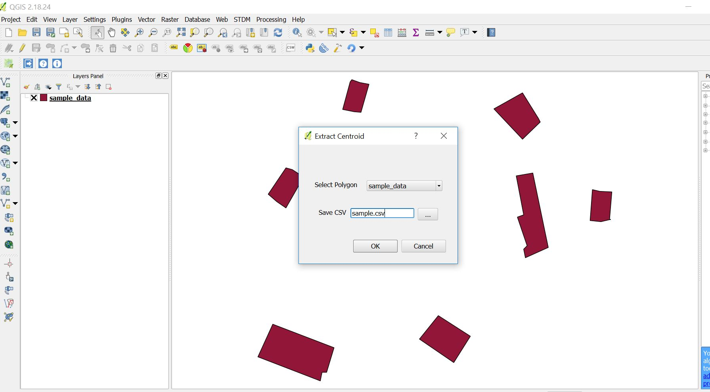

# Extract Centroids
**Version 0.1**

This QGIS plugins enables you to get centroids of polygonss in CSV format.

## How to use:
1. Go to Vector
2. Click on Extract Centroids
3. Select polygon of interest
4.Select path to save CSV

---

### Contributers
-Pondi Brian <@PondiB>
---
## License & Copyright
© Pondi Brian, Kenya